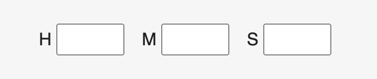
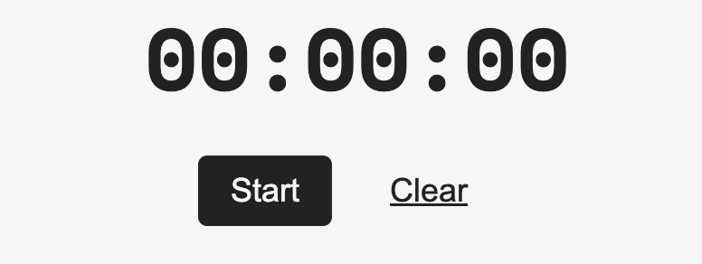
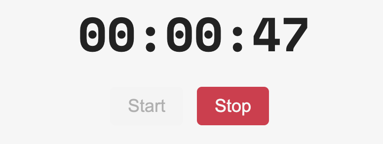

# Timer

A minimal timer that gets the job done.

## Getting started

Input the hours, minutes and seconds and start the countdown.

Start button - Begins the countdown.

Clear button - Resets the input and displayed time.

Stop button - Appears once the countdown has begun. Stops the countdown.

## Technologies

- HTML
- CSS
- JavaScript
